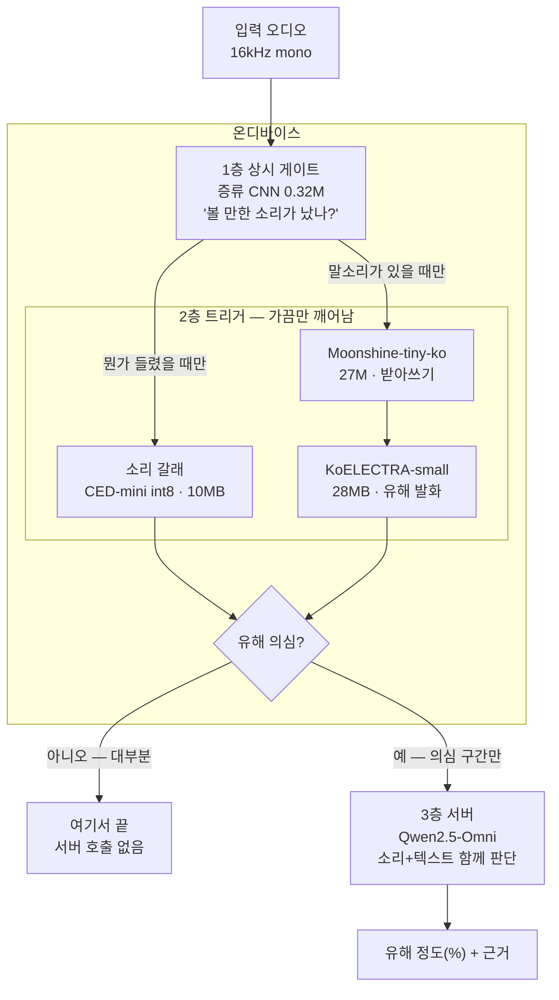
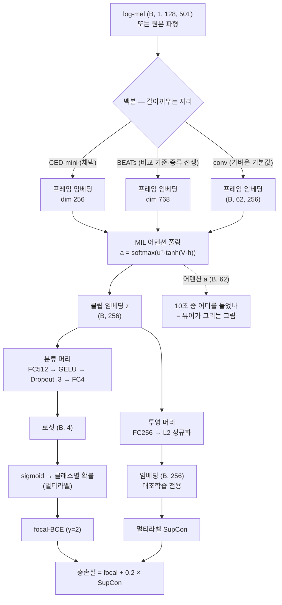

# 2. 각 층에 무슨 모델을 왜 골랐나

숫자는 전부 이 프로젝트에서 **직접 측정한 값**입니다. 외부에서 옮겨 적은 값이 아닙니다.
평가셋은 test 908클립(폭력 양성 210개)이고, 지표는 아래 [용어](#용어) 참고.

> !! 아래 recall@FPR 값들은 **임계값을 테스트셋에서 직접 고른(in-sample) 것**입니다.
> 즉 실제 배포에서 나올 값보다 조금 낙관적입니다. 모델 간 비교는 같은 조건이라 공정하지만,
> "실전에서 이만큼 잡는다"로 읽으면 안 됩니다.

---

## 한눈에 보기 — 채택된 스택

소리 하나가 들어와서 판정이 나오기까지, 각 층에 실제로 들어간 모델입니다.

위로 갈수록 자주 돌고 작으며, 아래로 갈수록 드물게 돌고 큽니다.
**배터리를 먹는 건 모델 크기가 아니라 크기 × 도는 빈도**라는 것이 이 그림의 전부입니다.

- 왼쪽 갈래(소리)와 오른쪽 갈래(말)는 경쟁이 아니라 **상호보완**입니다.
  시끄러워서 받아쓰기가 무너지는 구간을 소리 갈래가 맡습니다(아래 CER 표 참고).
- 1층 게이트는 **마이크 입력일 때만** 필요합니다. 기기 내 재생음을 캡처하는 경로에서는
  OS가 "재생 중"을 알려주므로 그게 공짜 게이트입니다(→ [01장](01-overview.md)).
- ⚠️ 그 1층 CNN은 실제로 이어붙여 재보니 **연산 이득이 없었습니다**(아래 1층 절 참고).
  그래서 실제 앱([04장](04-run.md))은 1층 없이 2층부터 돕니다.

---

## 2층 소리 갈래 — CED-mini int8 (10MB) 확정

처음엔 BEATs라는 90M짜리 오디오 모델을 썼습니다. 성능은 괜찮았는데 **364MB**였습니다.
휴대폰에 넣기엔 너무 큽니다. 그래서 9배 작은 CED-mini로 바꿔봤습니다.

| 모델 | 용량 | AP | R@10% | BEATs 대비 |
|---|---:|---:|---:|---|
| BEATs fp32 (기존) | 364MB | 0.811 | 0.771 | — |
| CED-mini fp32 | 39MB | 0.834 | 0.852 | @10% **+0.081 유의하게 좋음** |
| **CED-mini int8 (채택)** | **10MB** | **0.834** | **0.862** | @10% **+0.090 유의하게 좋음** |

**결론: 36배 작아졌는데 성능은 동등하거나 더 좋습니다.**

단, 위 표는 오경보율 10% 지점만 보여준 것입니다. 정직하게 전 구간을 보면:

| 동작점 | CED-mini int8 − BEATs |
|---|---|
| 오경보율 1% | −0.076 (차이 없음, ns) |
| 오경보율 5% | +0.010 (차이 없음, ns) |
| 오경보율 10% | **+0.090 (유의)** |

FPR 1%에서는 오히려 숫자가 낮습니다(통계적으로는 차이 없음).
원 판정은 "**동등~유의 우세**"입니다. 우리가 쓰는 동작점이 10%대라 채택한 것이지,
모든 구간에서 이겼다는 뜻이 아닙니다.

작은 모델이 더 잘하는 게 이상하게 들리지만, CED는 애초에 AudioSet에서
BEATs보다 좋은 점수(49.0 vs 48.6)를 내면서 파라미터는 1/9인 모델입니다.
"크면 좋다"가 항상 맞지는 않습니다.

int8 양자화(→ [03-training.md](03-training.md#양자화))로 39MB → 10MB를 더 줄였는데,
AP는 0.832 → 0.834로 사실상 그대로였습니다. 공짜로 3.8배 줄인 셈입니다.

> !! 이 비교에는 공정하지 않은 구석이 하나 있습니다. **CED-mini는 폭력 4종만 학습**했고,
> **BEATs 기준선은 23클래스를 학습한 뒤 폭력 열만 떼어 평가**한 것입니다.
> "지금 배포하려는 두 후보를 비교하면 이렇다"는 뜻이지, 완전히 동일 조건의 실험은 아닙니다.
> (다만 과제를 폭력만으로 단순화한 효과 자체는 별도 실험에서 미미했습니다.)
>
> "36배"도 **BEATs fp32 364MB vs CED int8 10MB**를 비교한 값입니다.
> 구조만 놓고 보면 364 → 39MB, 양자화만 놓고 보면 106 → 10MB입니다.

---

## 2층 말 갈래 — Moonshine-KR + KoELECTRA-small int8 (28MB) 채택

말은 두 단계입니다. **먼저 받아쓰고(ASR), 그 텍스트가 유해한지 판단합니다.**

### ① 받아쓰기: Moonshine-KR (27M) — 실측으로 선정

예전엔 "한국어 받아쓰기는 폰에서 무리, 서버로 보내자"고 결론냈었는데 **철회했습니다.**
한국어 특화 소형 모델이 나왔기 때문입니다.

세 후보를 우리 데이터로 직접 재봤습니다. 지표는 CER(글자 오류율, **낮을수록 좋음**).
깨끗한 음성(Zeroth-Korean 200발화)과, 같은 음성에 우리 폭력·혼동음을 SNR 10/5/0으로 섞은 것입니다.

| 후보 | 크기 | clean | SNR10 | SNR5 | SNR0 |
|---|---:|---:|---:|---:|---:|
| **Moonshine-tiny-ko (채택)** | 27M | **5.6%** | 20.7 | 38.9 | 73.5 |
| sherpa Zipformer-KR (기각) | ~60MB | 34.7% | — | — | — |
| Whisper large-v3 (서버급 참고) | 1.5B | 9.3% | — | — | **20.9** |

- Moonshine 27M이 **깨끗한 음성에서는 1.5B짜리 large-v3보다 좋습니다**(5.6 vs 9.3).
- Zipformer는 도메인이 안 맞아 전 구간 열세라 **기각**했습니다.
- 하지만 **시끄러워지면 무너집니다** — SNR0에서 73.5%면 거의 못 알아듣는 수준입니다.
  같은 조건에서 large-v3는 20.9입니다. **노이즈 강건성이 큰 모델의 진짜 값어치**입니다.
- 그래서 설계 전제가 하나 추가됐습니다: 시끄러운 유해 장면은 말 갈래가 아니라
  **소리 갈래(CED-mini)가 잡아서 서버로 넘긴다.** 두 갈래는 경쟁이 아니라 상호보완입니다.
- caveat: Zeroth가 Moonshine 학습 데이터에 포함됐을 수 있어 clean 점수는 낙관적일 수 있습니다.

**후일담 — CER로 모델을 고르면 안 된다는 걸 배웠습니다 (2026-07-30).**
CER 기준으로는 moonshine-**base**-ko(61.5M)가 훨씬 좋아서(clean 2.8%) 잠깐 기본값으로
바꿨었는데, 욕설·은어 발화를 넣어보니 **15%의 발화에서 전사 대신 "audiotext"라는 문자열을
뱉었습니다** — "야 이 씨발놈아 당장 나와"도 그렇게 사라졌고, tiny는 멀쩡히 받아썼습니다.
낭독체 CER은 이 실패를 볼 수 없는 지표였던 겁니다. 그래서 평가 기준을 바꿨습니다:
**"유해 단어가 전사에 살아남는가"**(`.autorun/compare_asr_harm.py`). 그 기준으로 재보니
(욕설 recall / 은어 recall / 환각률 / int8 크기):

| 후보 | 욕설 | 은어 | 환각 | 크기 |
|---|---:|---:|---:|---:|
| **moonshine-tiny (채택 유지)** | **.889** | .23 | **0** | 27MB |
| moonshine-base | .611 | .27 | **.15** | 62MB |
| whisper-base int8 | .556 | .46~.59 | 0 | 80MB |
| whisper-small int8 | .833 | .50 | 0 | 250MB (예산 초과) |

tiny의 욕설 .889는 **완벽한 전사를 줬을 때의 상한과 같습니다** — 욕설에 관한 한 27M으로
손실이 없습니다. 은어는 어떤 ASR도 예산 안에서 못 잡는데(모델이 그 단어를 모름), 그건
ASR이 아니라 **텍스트 쪽에서** 풀었습니다(아래 ③).

### ② 유해 판단: KoELECTRA-small-v3 (14M → int8 28MB)

여기서 이 프로젝트에서 가장 중요한 실험 하나가 나옵니다.

**문제**: 받아쓰기는 틀립니다. "죽여버린다"가 "죽어버린다"로 적힐 수 있습니다.
깨끗한 문장으로만 학습시킨 분류기는 이런 오타에 완전히 무너집니다.

**실험**: 학습할 때 일부러 받아쓰기 오류를 흉내낸 오타를 섞어봤습니다(ASR 노이즈 증강).
CER은 글자 오류율 — CER20이면 글자 5개 중 1개가 틀린 상태입니다.

지표는 **recall@FPR15%** — 오경보를 15%까지 허용했을 때 유해 발화를 몇 % 잡았나입니다.

| 모델 | 깨끗한 문장 | CER 5% | CER 20% | CER 40% |
|---|---:|---:|---:|---:|
| KoELECTRA-small (깨끗하게만 학습) | .948 | .815 | .416 | .260 |
| **+ ASR 노이즈 증강 (채택)** | .884 | .856 | **.803** | **.728** |
| e5+MLP (훨씬 큰 선생 모델) | .890 | .821 | .572 | .387 |

읽는 법:
- 깨끗한 문장만 보면 위쪽이 더 좋아 보입니다(.948 vs .884). **여기서 멈추면 오답입니다.**
- 실제로 받아쓰기를 거친 텍스트(CER 20%)에서는 **.416 → .803, 두 배 차이**가 납니다.
- 훨씬 큰 모델(e5+MLP, 서버급 선생)도 노이즈에서는 작은 모델에 집니다(.572 vs .803).
  **모델을 키우는 것보다 "실제로 들어올 입력으로 학습시키는 것"이 이겼습니다.**

**교훈: 벤치마크 점수가 아니라 실제로 들어올 입력으로 평가해야 합니다.**

int8 양자화로 56MB → 28MB. 여기서도 손실은 거의 없었습니다
(깨끗한 문장 .884 → .867, CER20 .803 → .809 — 오히려 노이즈에서는 미세하게 올랐습니다).

> !! 이 int8 수치를 만든 **전용 스크립트**는 이 브랜치에 없습니다
> (`train_koelectra.py`는 fp32로 저장합니다). 다만 실제 앱과 캐스케이드는
> `src/cascade/pipeline.py`의 `TextScorer(int8=True)`로 **로드할 때 양자화해서** 씁니다 —
> 즉 배포 경로는 int8이 맞습니다. 재현용 독립 스크립트를 만드는 건 남은 일입니다.

### ③ 그리고 실제 받아쓰기 출력으로 다시 재봤습니다 — 위 표는 낙관적이었습니다

위 표의 "CER 20%"는 우리가 **인위적으로 자모를 흔들어** 만든 것입니다.
학습 증강과 평가 오류가 같은 방식이라(시드만 다름) 유리하게 나왔을 수 있어서,
**Moonshine의 실제 출력**으로 다시 측정했습니다:

| 조건 | 실제 CER | recall (고정 임계값) | 인위적 오타 대비 |
|---|---:|---:|---|
| 조용함 | .197 | .723 | −2pt |
| SNR10 | .347 | .601 | −7pt |
| SNR5 | .449 | .485 | **−19pt** |

노이즈가 커질수록 격차가 벌어집니다. 실제 받아쓰기 오류는 자모가 틀리는 게 아니라
**뜻이 통하는 무해한 말로 바뀌거나**, 같은 말을 반복하는 환각이거나, 문장이 잘리기 때문입니다.
자세한 해석과 TTS 편향 보정은 [05장 ③](05-limits.md)에 있습니다.

### ④ 그래서 "진짜 오류"로 다시 학습시켰습니다 — 은어까지 (2026-07-30, 최종 채택)

②의 교훈("실제로 들어올 입력으로 학습")을 끝까지 밀었습니다. 두 가지를 학습에 추가했습니다:

- **은어 말뭉치 1,400행** — 기존 말뭉치에 욕설 5행·은어 0행뿐이라 "떨/사다리/조건 만남"
  같은 은어를 완벽한 전사에서도 절반쯤 놓치고 있었습니다. 용어 4개는 **일부러 빼고** 학습해
  처음 보는 은어에도 되는지 측정했습니다.
- **진짜 받아쓰기 오류 2,740행** — 은어 문장을 TTS→노이즈→Moonshine에 통과시켜 나온
  실제 오인식("먹튀"→"목키")을 원래 라벨과 함께 학습. 단 유해어가 **흔한 일상어로 바뀐**
  행("떨"→"또")은 뺐습니다 — 그걸 배우면 "또 한번 할래"를 마약으로 오인하게 됩니다.

결과 (recall@FPR15%, 욕설·은어 40행):

| 경로 | 재학습 전 | **재학습 후** |
|---|---:|---:|
| 완벽한 전사 | .775 | **1.000** |
| 실제 ASR, 조용함 | .525 | **.925** |
| 실제 ASR, SNR10 | .400 | **.850** |
| 기존 유해발화 173행 (회귀 확인) | .855 | **.902** |

학습에서 뺀 용어 4개도 전부 잡혔고, 그중 2건은 어휘 목록 도움 없이 분류기 혼자
완전히 망가진 전사("닭 댁이 맞으면…")에서 발화했습니다 — 단어 암기가 아니라 문맥을 배운 겁니다.

**채택 아티팩트 = `koelectra_small_harm_asraug_slang` + 은어 어휘목록(hybrid max).**
caveat: 평가와 학습이 같은 TTS 목소리·같은 ASR·같은 노이즈를 공유하므로 이 숫자는
낙관적입니다. 깨끗한 일반화 증거는 홀드아웃 용어 4건뿐입니다.

---

## 1층 상시 게이트 — 0.32M 증류 CNN

24시간 도는 층이라 **1M 파라미터 이하**여야 합니다.

BEATs(선생)의 판단을 작은 CNN(학생)에게 베끼게 하는 **지식 증류**로 만들었습니다.
그런데 여기서 예상 밖의 결과가 나왔습니다.

| 학생 크기 | test AP |
|---|---:|
| 0.32M | 0.618 |
| 0.94M | 0.607 |
| 2.9M | 0.633 |

**크기를 9배 키워도 점수가 오르지 않았습니다.** (선생 BEATs는 0.811입니다.)

점수가 똑같지는 않습니다 — 제일 큰 게 0.633으로 미세하게 높습니다.
하지만 부트스트랩 신뢰구간이 서로 겹칩니다. **"차이가 있다"고 말할 수 없는 정도**입니다.
크기를 9배 키운 대가로 얻은 게 신뢰구간 안에서 사라지는 수준이라는 뜻입니다.

이건 "모델이 작아서 못한다"가 아니라 **"데이터가 8,648클립뿐이라 거기가 천장"**이라는 뜻입니다.
증류로 선생을 거의 따라잡으려면 AudioSet 200만 클립급 데이터가 필요하다는 선행 연구와도 맞습니다.

그래서 **어차피 천장이 같으면 제일 작은 걸 쓴다** → 0.32M 확정.
1층은 어차피 정밀할 필요가 없습니다. 오경보율을 30~50%로 크게 열어두고
"폭력을 놓치지 않는 것"만 맡기면 됩니다. 정밀 판정은 2층과 서버의 몫입니다.

### 그런데 3층을 실제로 이어붙여 보니, 1층이 이득이 아니었습니다 (2026-07-30)

셋을 하나로 묶어 test 908클립에서 재봤습니다 (`.autorun/cascade_offline.py`).

| 구성 | recall | 오경보율 |
|---|---:|---:|
| 1층 게이트만 (@0.133) | 0.962 | — (전체의 69.5%를 깨움) |
| 2층 단독 (@0.620) | 0.662 | 0.050 |
| **1층 → 2층 캐스케이드** | **0.657** | 0.049 |

**좋은 소식**: 게이트를 끼워도 recall 손실이 **0.5pt**(양성 210개 중 8개)뿐입니다.
"게이트와 트리거를 같은 데이터로 비슷한 놓침율로 학습하면 결합 놓침율이 트리거 단독과 거의 같다"는
선행 연구([kws-cascade](../references.md))가 우리 데이터에서도 성립했습니다.

**나쁜 소식**: 게이트가 **연산을 절약하지 못했습니다.**
CPU에서 창 하나당 게이트 **17ms**, 2층 트리거 **16ms** — 거의 같습니다.
그래서 게이트 경로 총비용은 `17 + 0.695 × 16 = 29ms`인데, 트리거만 돌리면 `16ms`입니다. **1.8배 손해.**

왜 이렇게 됐나 — **파라미터 수가 연산량을 대변하지 못했습니다.**
0.32M 게이트는 fp32 CNN이 **로그멜 전체(64×약1000)에 컨볼루션**을 돌립니다.
반면 10M CED-mini는 int8이고 토큰이 248개뿐인 트랜스포머라 이미 훨씬 쌉니다.
"작은 모델 = 싼 모델"이 항상 참이 아니라는 걸 직접 확인한 셈입니다.

**그래서 실제 앱([04장](04-run.md))에서는 1층을 넣지 않았습니다.**
재생음 감시에서는 어차피 OS가 "지금 재생 중인가"를 공짜로 알려주니 그게 1층 역할을 합니다.
마이크 경로에 1층이 필요해지면 CNN이 아니라 **에너지/VAD 같은 진짜 싼 것**으로 바꿔야 합니다.

---

## 모델 하나의 속은 어떻게 생겼나

층마다 백본은 다르지만, **그 뒤에 붙는 부분은 전부 같습니다.**
백본을 갈아끼워도 나머지를 다시 안 짜도 되게 만든 구조입니다
(코드는 `src/models/harm_model.py`, 줄 단위 해설은 [07장](07-code.md)).

읽는 법 세 가지만.

1. **가운데 `MIL 어텐션 풀링`이 이 모델의 성격입니다.** 10초 클립에 라벨은 하나인데 총성은
   0.5초일 수 있습니다. 그래서 프레임마다 가중치를 매겨 평균 냅니다. 그 가중치가 곧
   "어디를 들었는가"라서, 부산물로 **위치 설명**이 공짜로 나옵니다.
2. **머리가 두 개인 이유**는 목적이 둘이기 때문입니다. 분류 머리는 정답을 맞히고,
   투영 머리는 "비슷한 것끼리 뭉치게" 만듭니다. 추론할 때 투영 머리는 버립니다.
3. **마지막이 softmax가 아니라 클래스별 sigmoid**입니다. 비명과 총성이 동시에 날 수 있으니
   "하나만 고르기"가 아니라 "각각 예/아니오"여야 합니다.

## 3층 서버 — Qwen2.5-Omni-7B (학습 없이 프롬프트로, **실동작 확인됨**)

이 레포에 3층 학습 코드는 **없습니다. 빠진 게 아니라 설계상 없는 겁니다.**

Qwen2.5-Omni는 소리와 텍스트를 같이 이해하는 큰 멀티모달 모델이고,
우리는 이걸 **학습시키지 않고 프롬프트로 씁니다.** 여기서는 프롬프트가 곧 코드입니다
(`src/app/judge.py` — 오디오+전사를 주고 정도(%)·범주·근거를 JSON으로 받습니다).

이유: 정도(%)와 맥락 판정은 "이런 소리 = 폭력"처럼 라벨로 정의하기 어렵습니다.
뉴스의 총성과 게임의 총성을 가르는 건 소리가 아니라 **상황**이고,
그건 이미 세상을 많이 본 큰 모델이 훨씬 잘합니다.

**실측 (2026-07-30, RTX 3060 12GB)**: 7B를 4-bit로 줄이면 **VRAM 6.3GB**로 로드되고
(12GB 카드에서 돌릴 수 있는 최대 크기), 사건 하나당 **약 6초**에 판정합니다.
음성 출력부(Talker)는 안 올립니다 — 서버는 말할 필요가 없어서, 그만큼 메모리를 아낍니다.

| 입력 | 판정 |
|---|---|
| 욕설 영화 장면 | **80% / abuse** — "어른이 청소년을 비하하고 폄하하는 내용이 포함되어 있습니다" |
| 평범한 문장 | **0% / none** — "회의 시간 정보이며 청소년 유해 콘텐츠와 관련이 없습니다" |

> ⚠️ 위 2건이 지금까지의 검증 전부입니다. 정도(%)가 사람 판단과 얼마나 일치하는지는
> 라벨된 평가셋으로 재봐야 하고, 그게 [05장](05-limits.md)의 다음 큰 숙제입니다.

---

## 기각된 것들 (혹시 모르니 납깁니다)

실패한 시도도 결과입니다. (자세한 기록은 `process` 브랜치에 있습니다.)

| 시도 | 결과 |
|---|---|
| BEATs 층 수 줄이기 (12층 → 6층) | **기각** — recall이 유의하게 나빠짐. 경량화 지렛대가 아니었음 (8층은 아예 학습 안 함) |
| 학생 모델 키우기 | **무의미** — 위 표대로 평탄. 천장은 데이터 |
| mixup 증강 | **끔** — 총성 recall이 떨어져 보였음. 단일 시드라 결론은 못 냄 |
| fp16 학습 | **쓰지 않음** — BEATs에서 NaN 발생. 채택 스크립트는 bf16 고정 (참고로 이건 GPU에 따라 달라질 수 있으니 환경을 잘 확인하세요)|

---

## 용어

| 용어 | 뜻 |
|---|---|
| **AP** | 평균 정밀도. 1에 가까울수록 좋음. 양성이 드문 문제에서 정확도보다 정직한 지표 |
| **recall (재현율)** | 진짜 유해한 것 중 몇 %를 잡았나. **놓침의 반대** |
| **FPR (오경보율)** | 무해한 걸 유해라고 잘못 부른 비율 |
| **R@10%** | 오경보율을 10%로 맞췄을 때의 recall. 동작점을 고정하고 비교하는 방식 |
| **유의하게(SIG)** | 부트스트랩으로 재본 결과, 우연이 아니라고 볼 수 있는 차이 |
| **int8 양자화** | 실수(32비트) 가중치를 정수(8비트)로 바꿔 용량을 줄이는 것. 이론상 4배지만 실제로는 2~3.8배 ([03장](03-training.md#양자화)) |
| **CER** | 글자 오류율. 받아쓰기가 얼마나 틀렸나 |

다음: [03-training.md](03-training.md) — 이걸 실제로 어떻게 학습시켰나
