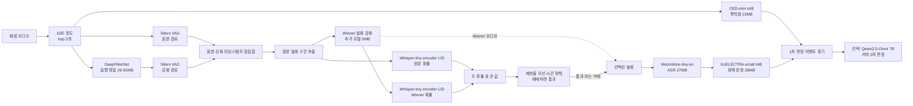

# 8. 한국어 음성 게이트 통합

## 목적

기존 실시간 앱의 음향 유해성 경로는 그대로 유지하면서, ASR에 들어가기 전에 한국어 음성만
우선적으로 남긴다. 이 단계의 최우선 조건은 **한국어 누락을 최소화하는 것**이다. 따라서 애매한
발화는 통과시키고, 길이가 충분하면서 비한국어 확률이 연속으로 매우 높을 때만 억제한다.

## 최종 구조



중요한 점은 CED-mini가 항상 **원본 10초 오디오**를 받는다는 것이다. 언어 게이트가 비한국어를
억제하거나 오류를 내더라도 총성·비명·폭발 같은 음향 유해성 경로에는 영향을 주지 않는다.

## 처리 순서

1. ASR 듀티사이클에 도달한 새 오디오 조각을 DeepFilterNet으로 먼저 강화한다.
2. 원본과 강화본 양쪽에 동일한 Silero VAD를 적용한다.
3. 두 VAD의 음성 타임스탬프를 합친다. 한쪽에서만 발견한 음성도 버리지 않는다.
4. 합쳐진 타임스탬프로 원본에서 2~5초 발화 그룹을 만들고, 각 그룹을 Wiener 방식으로 다시
   강화한다. DeepFilterNet 출력은 VAD 위치를 찾는 데만 쓰고 ASR 입력으로 직접 쓰지 않는다.
5. 원본 그룹과 Wiener 강화 그룹의 한국어 확률 중 큰 값을 사용한다. 강화가 언어 특징을
   훼손해도 원본 판정으로 복구하기 위한 재현율 우선 선택이다.
6. 한국어이거나 애매하면 통과시킨다. 충분히 긴 강한 비한국어 판정이 연속될 때만 억제한다.
7. 통과한 강화 음성을 기존 ASR → KoELECTRA 경로로 보낸다.

기본 Silero 임계값은 `0.10`이다. VAD가 무음이 아닌 입력에서 아무것도 찾지 못하거나 게이트
내부에서 오류가 나면 기본 설정은 사용 가능한 원본 또는 강화 오디오를 ASR로 보내는
**fail-open**이다. 한국어
생략을 줄이는 대신 일부 비한국어와 비음성이 넘어갈 수 있는 의도적인 선택이다.

## 모델·아티팩트 용량과 온디바이스 판단

| 구성 | 파일 크기 | 현재 적용성 | 온디바이스 판단 |
|---|---:|---|---|
| DeepFilterNet Windows CLI | 26.91MB | Windows x86-64에서 직접 실행 | 데스크톱 프로토타입 가능. 모바일/macOS에는 이 실행 파일을 그대로 넣을 수 없어 native/ONNX/Core ML 어댑터가 필요 |
| Silero VAD TorchScript | 2.27MB | CPU 실시간 조각 처리 | 데스크톱 적용 가능. 휴대폰은 ONNX/Core ML 변환과 지연 측정 필요 |
| Whisper-tiny encoder LID 체크포인트 | 16.48MB | CPU/CUDA/MPS 판별 | 저장 크기는 작아 적용 후보. CPU 로드 시 fp32 가중치와 활성값 때문에 실제 RAM은 파일 크기보다 큼 |
| Wiener 발화 강화 | 추가 파일 0MB | PyTorch STFT 기반 | 모델 용량은 없지만 연산량·활성 메모리는 측정 필요 |
| **새 게이트 합계** | **45.66MB** | DeepFilter 포함 | 데스크톱은 가능. 모바일은 DeepFilter 교체와 모델 런타임 최적화 후 확정 |
| CED-mini int8 | 10MB | 기존 음향 경로 | 온디바이스 채택 모델 |
| Moonshine-tiny-ko | 약 27MB | 기존 ASR | 온디바이스 채택 모델 |
| KoELECTRA-small int8 | 28MB | 기존 텍스트 분류 | 온디바이스 채택 모델 |

새 게이트와 기존 세 모델의 파일 크기를 단순 합산하면 약 **110.66MB**다. 이는 런타임,
토크나이저, 활성 메모리를 제외한 값이므로 설치 용량이나 최대 RAM과 같지 않다. DeepFilterNet
대신 내장 Wiener 보강을 쓰면 추가 모델 파일은 Silero+LID 약 **18.75MB**로 줄지만, 실제 영화
음성에서 DeepFilterNet과 동일한 VAD 개선을 보장하지 않는다.

## 실행

모델 경로를 직접 전달한다.

```powershell
$env:PYTHONUTF8 = "1"
uv run --group nlp python -m app.main `
  --source file --file C:\path\to\movie.wav --realtime `
  --language-gate `
  --language-gate-vad C:\models\silero_vad.jit `
  --language-gate-checkpoint C:\models\whisper_tiny_encoder_lid.pt `
  --deepfilter-exe C:\models\deep-filter.exe
```

환경 변수 `SILERO_VAD_MODEL`, `KOREAN_LID_CHECKPOINT`, `DEEPFILTER_EXE`로 경로를 지정할
수도 있다. `--deepfilter-exe`를 빼면 Wiener 보강으로 대체된다. 기본값은 게이트 오류 시
fail-open이며, 오류 즉시 중단이 필요한 개발 검사에서만 `--language-gate-strict`를 쓴다.

## 검증 결과

2026-08-23에 미나리 한국어 음성 2.848초를 실제 모델 세 개로 통과시킨 스모크 테스트 결과:

| 항목 | 결과 |
|---|---:|
| 원본 VAD | 2.824초 |
| 강화 VAD | 2.824초 |
| 합집합 VAD | 2.824초 |
| 한국어 확률, 원본 / Wiener | 0.568580 / 0.974427 |
| 최종 정책 | 한국어로 통과 |
| 최종 출력 | 2.824초, 발화 그룹 1개 유지 |
| DeepFilterNet 실행 시간 | 561.2ms |
| DeepFilterNet RMS 변화 / 상관계수 / 클리핑 | -9.9387dB / 0.630458 / 0% |
| Wiener RMS 변화 / 상관계수 / 클리핑 | -4.1175dB / 0.959531 / 0% |

RMS 감소만으로 음성 강화 성공을 단정하지 않는다. 구현은 DeepFilterNet 사전 VAD 강화와
Wiener 발화 강화 각각의 입력/출력 RMS, 제거된 성분의 RMS, 상관계수, 클리핑 비율을 매 결과의
`language_gate.enhancement`에 기록한다. 동시에 원본·강화 VAD 초와 원본·Wiener LID 확률도
남기므로, 강화가 실제로 VAD를 돕는지와 언어 특징을 지나치게 훼손하는지를 함께 확인할 수 있다.

## 아직 남은 검증

- 여러 한국 영화 전체 구간에서 한국어 발화 누락률과 비한국어 억제율을 사람 라벨로 측정
- Windows CLI가 아닌 스트리밍 DeepFilterNet 런타임으로 교체해 지연·CPU·RAM 재측정
- 휴대폰 대상 ONNX/Core ML 변환 후 발열과 배터리 사용량 측정
- 게이트를 통과한 실제 영화 발화에서 기존 Moonshine → KoELECTRA 종단 성능 평가

따라서 현재 상태는 **실시간 프로젝트에 구조를 연결하고 실제 모델 단일 스모크 테스트까지
통과한 단계**다. 전체 영화 데이터셋에서 한국어 누락이 0이라고 아직 결론내리지는 않는다.
